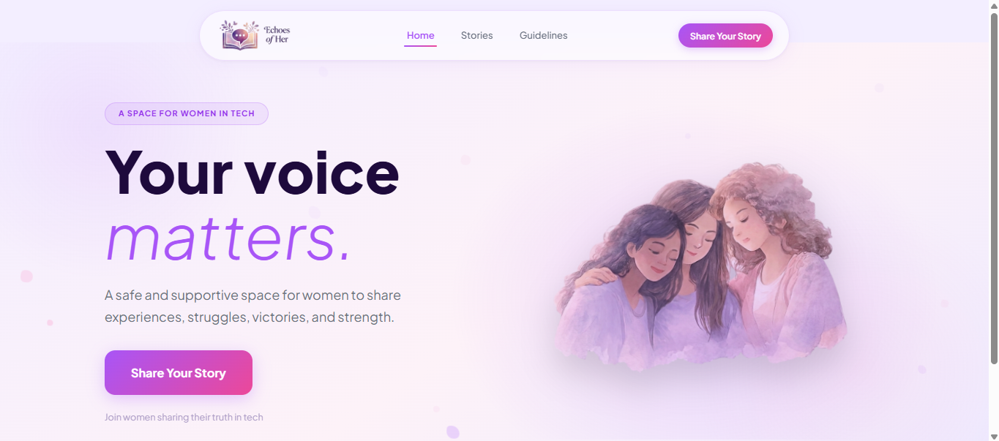
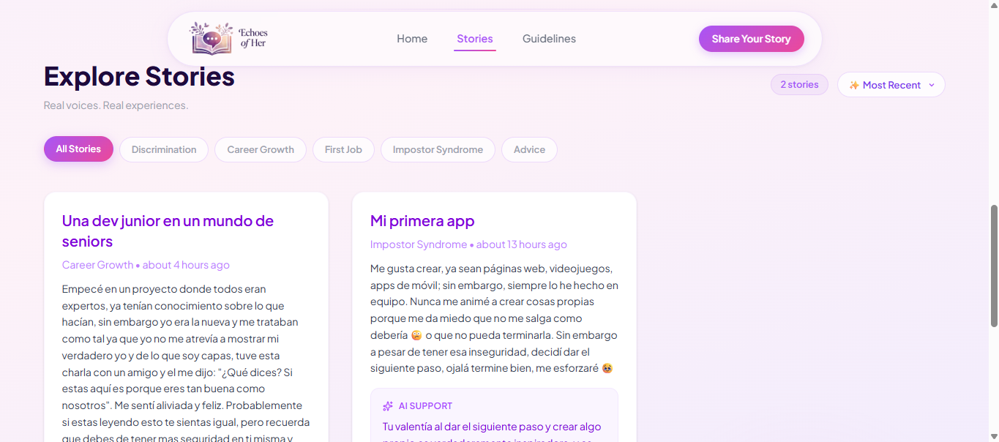
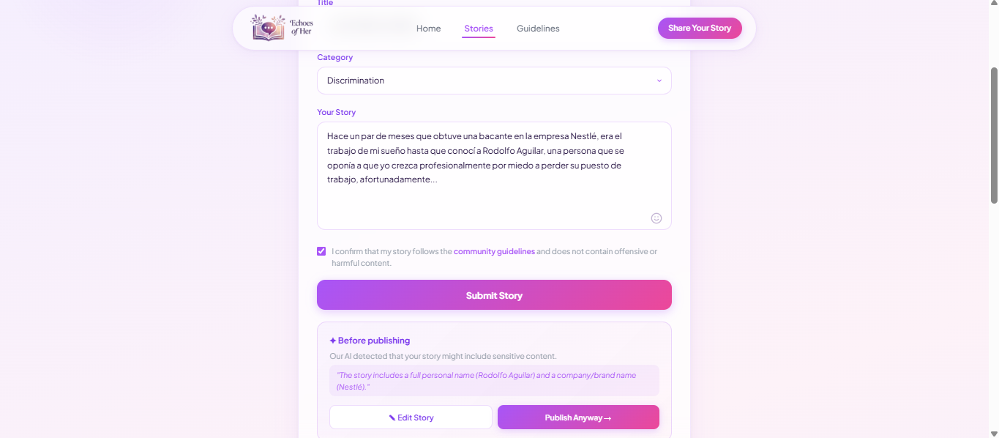
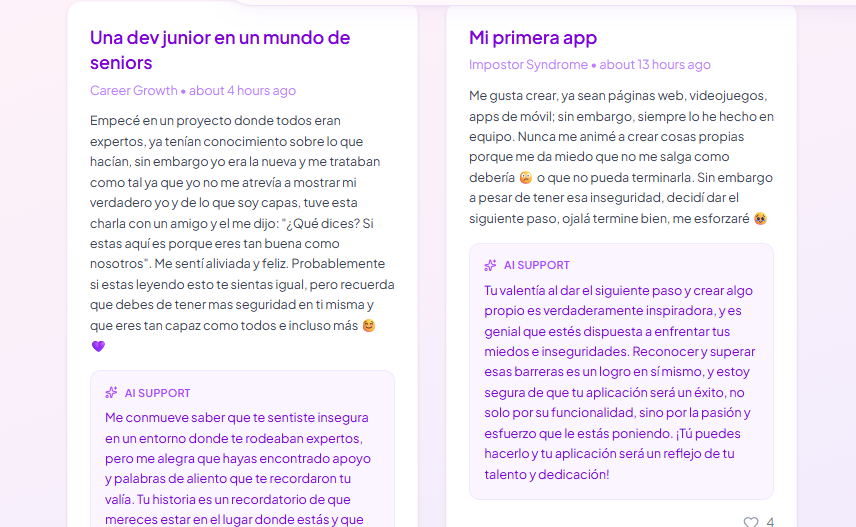
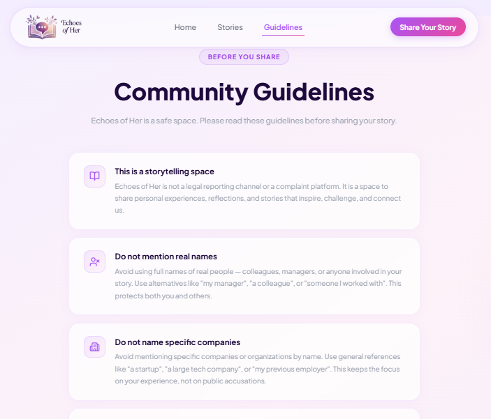
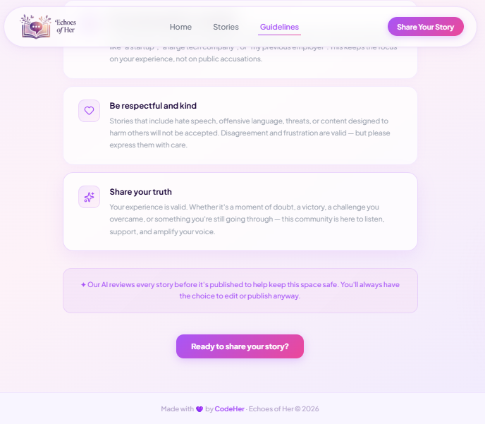

# 🌸 Echoes of Her

> *Tu voz importa. Este es un espacio seguro.*

**Echoes of Her** es una plataforma web para compartir, preservar y amplificar historias de mujeres que inspiran, resisten y transforman el mundo tecnológico. Un espacio digital donde las voces femeninas pueden ser escuchadas, celebradas y recordadas.

🔗 **Demo en vivo:** [echoes-of-her.vercel.app](https://echoes-of-her.vercel.app)

---

## 📸 Screenshots

### 🏠 Landing Page


### 📖 Historias


### 🤖 Moderación con IA


### 💜 Mensaje de Apoyo IA


### 📋 Lineamientos



---

## ✨ Funcionalidades

- 📝 **Publicar historias** con título, contenido y categoría
- 🔍 **Explorar relatos** filtrados por categoría y ordenados por fecha o likes
- 💜 **Likes** para expresar apoyo a las historias
- 🤖 **Moderación con IA** — detecta nombres reales, empresas y lenguaje ofensivo antes de publicar
- ✨ **Mensajes de apoyo con IA** — genera un mensaje empático y alentador para cada historia
- 📋 **Lineamientos de comunidad** para mantener un espacio seguro y respetuoso

---

## 🛠️ Stack Tecnológico

**Frontend:**
- React + Vite
- React Router
- Tailwind CSS v4
- Lucide React

**Backend:**
- Node.js + Express
- MongoDB + Mongoose
- Groq API (openai/gpt-oss-120b) para moderación y mensajes de apoyo

**Deploy:**
- Frontend → Vercel
- Backend → Render
- Base de datos → MongoDB Atlas

---

## 🚀 Correr el proyecto localmente

### Requisitos previos
- Node.js v18+
- MongoDB Atlas (o MongoDB local)
- Cuenta en [Groq](https://console.groq.com) para la API key

### 1. Clonar el repositorio
```bash
git clone https://github.com/Geraldine04Umasi/EchoesOfHer.git
cd EchoesOfHer
```

### 2. Configurar el Backend
```bash
cd server
npm install
```

Crea un archivo `.env` en la carpeta `server/`:
```env
MONGO_URI=tu_uri_de_mongodb_atlas
GROQ_API_KEY=tu_groq_api_key
PORT=5000
```

Inicia el servidor:
```bash
npm run dev
```

### 3. Configurar el Frontend
```bash
cd client
npm install
```

Crea un archivo `.env` en la carpeta `client/`:
```env
VITE_API_URL=http://localhost:5000
```

Inicia el frontend:
```bash
npm run dev
```

### 4. Abrir en el navegador
```
http://localhost:5173
```

---

## 🤖 Flujo de IA
```
Usuario escribe historia
        ↓
POST /stories/check
(IA revisa nombres, empresas y lenguaje ofensivo)
        ↓
¿Contenido sensible?
   ↓ Sí              ↓ No
Advertencia       Publicar directo
Editar / Publicar igual
        ↓
POST /stories (guarda en MongoDB)
        ↓
POST /stories/:id/ai-support
(IA genera mensaje de apoyo personalizado)
        ↓
Mensaje visible en la tarjeta 💜
```

---

## 👩‍💻 Equipo

Hecho con 💜 por **CodeHer**

---

## 📄 Licencia

MIT